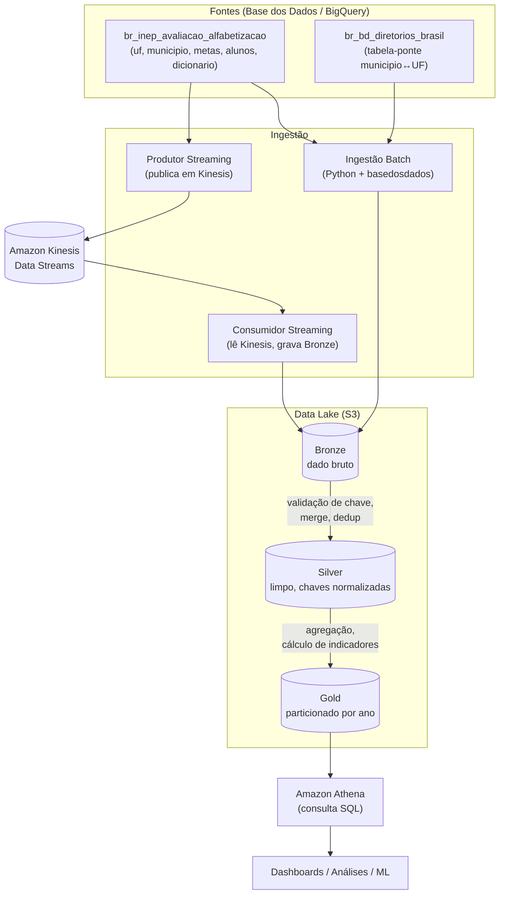

# Pipeline Híbrido para Análise da Alfabetização no Brasil

Tech Challenge – Fase 2 | Pós-Tech | AI Scientist

## 1. Contexto do Problema

A alfabetização na infância é um dos pilares do desenvolvimento educacional, social e econômico do país. O **Compromisso Nacional Criança Alfabetizada** é uma política pública que mobiliza União, estados, Distrito Federal e municípios com o objetivo de garantir que todas as crianças brasileiras estejam alfabetizadas até o final do 2º ano do ensino fundamental, com meta nacional de universalização até 2030.

Para apoiar a definição de parâmetros nacionais, o INEP realizou em 2023 a Pesquisa Alfabetiza Brasil, definindo o corte de **743 pontos** na escala de proficiência do Saeb como referência de alfabetização. A partir desse parâmetro foi criado o **Indicador Criança Alfabetizada**, que expressa o percentual de estudantes que atingem esse patamar.

Compreender os fatores que influenciam a alfabetização exige integrar diferentes fontes de dados, metas nacionais, estaduais e municipais, dados territoriais e microdados educacionais. Este projeto constrói uma pipeline de dados em nuvem para viabilizar essa integração, com qualidade, escalabilidade e controle de custo.

## 2. Arquitetura da Solução

A pipeline segue a **Arquitetura Medalhão** (Bronze → Silver → Gold), implementada na AWS, com ingestão híbrida (batch + streaming simulado).



### Fluxo de dados

1. **Ingestão batch**: script Python consulta as tabelas de referência e metas via `basedosdados` (BigQuery) e grava o resultado bruto, em Parquet, na camada Bronze do S3.
2. **Ingestão streaming simulada**: um produtor lê a tabela `alunos` (amostra de 3.000 registros) e publica cada linha como um evento individual no Kinesis Data Streams; um consumidor lê os eventos de todos os shards ativos e grava o resultado consolidado na Bronze.
3. **Bronze → Silver**: cada fonte passa por validação de chave primária/composta (com `raise` interrompendo o pipeline em caso de duplicidade inesperada), normalização de chaves entre tabelas (via tabela-ponte de diretórios) e padronização de valores categóricos.
4. **Silver → Gold**: junção das fontes tratadas, cálculo de indicadores e metas, e gravação particionada por `ano` nas 3 tabelas analíticas finais.
5. **Consumo**: as tabelas Gold ficam disponíveis para consulta via Amazon Athena, prontas para dashboards, análise estatística ou treinamento de modelos.

### Tabelas Gold entregues

| Tabela | Descrição | Particionamento |
|---|---|---|
| `meta_resultado` | Indicador de alfabetização comparado à meta oficial por município/ano, com flag `bateu_meta` | `ano` |
| `indicador_municipio` | Indicador de alfabetização por município | `ano` |
| `evolucao_uf` | Indicador médio agregado por UF, permitindo análise de tendência temporal | `ano` |

## 3. Decisões Arquiteturais (Trade-offs)

**Batch vs. Streaming** — Classifiquei as fontes por granularidade e frequência de mudança real. Fontes de referência e metas (`UF`, `Município`, `Metas`) têm poucas linhas e mudam por ciclo de política pública: ingeridas via batch. `Alunos` tem granularidade fina (uma linha por aluno) e alto volume: foi eleita a streaming simulado, representando o caso real de chegada incremental de resultados de avaliação. Importante registrar: no teste realizado, produtor e consumidor rodam **sequencialmente** (não concorrentemente), o que é uma simplificação consciente do streaming real, o Kinesis retém os dados por 24h, permitindo essa simulação sem perda de dado.

**Execução local vs. Lambda/Glue gerenciados** — A arquitetura planejada previa Lambda para ingestão leve e Glue para transformação distribuída. Dado o prazo do projeto e a complexidade de empacotamento de dependências pesadas (pandas, basedosdados) em Lambda Layers, a implementação atual executa os scripts de ingestão e transformação localmente, com boto3 e IAM de acesso programático, preservando a mesma lógica que seria portada para Lambda/Glue em um ambiente produtivo. Essa é uma decisão documentada de escopo, não uma limitação técnica da arquitetura proposta.

**Bronze sem particionamento** — A Bronze prioriza fidelidade ao dado bruto; particionamento é otimização de leitura, relevante para quem consome dado (Silver/Gold), não para quem só precisa preservar histórico.

**JOIN com `how="left"` em vez de `inner`** — Preserva todas as linhas da tabela principal e usa `NaN` para sinalizar ausência de correspondência, permitindo quantificar e documentar problemas de chave em vez de descartar dado silenciosamente.

**Interpretação de `rede="Pública"` nas tabelas de Meta** — As tabelas de Meta usam texto resumido (`"Municipal"`, `"Pública"`) em vez do código numérico das demais tabelas. Foi mapeado `"Pública"` para o código de rede pública completa (Federal+Estadual+Municipal), coerente com o escopo nacional/estadual da meta. Municípios só têm meta em nível `"Municipal"`, refletindo que a gestão municipal só responde pela própria rede.

## 4. Tecnologias Utilizadas

| Tecnologia | Papel | Justificativa |
|---|---|---|
| Amazon S3 | Data lake (Bronze/Silver/Gold) | Armazenamento de objetos barato, versionável por prefixo, nativo para Parquet particionado |
| Amazon Kinesis Data Streams | Streaming simulado | Permite múltiplos consumidores independentes do mesmo fluxo; modo on-demand evita gestão manual de capacidade |
| Amazon Athena | Consulta analítica da Gold | SQL direto sobre Parquet no S3, sem infraestrutura de banco dedicada; cobrança por dado escaneado, beneficiada pelo particionamento |
| AWS IAM | Controle de acesso | Usuários/políticas com permissão mínima (least privilege) por bucket e por stream |
| AWS Budgets | Controle de custo | Alerta de orçamento mensal, para monitoramento proativo de gasto |
| Python (pandas, boto3, basedosdados) | Ingestão e transformação | Ecossistema maduro para dados tabulares; `basedosdados` dá acesso direto às tabelas via BigQuery sem necessidade de download manual |
| Parquet | Formato de armazenamento | Colunar, comprime melhor que CSV, permite leitura seletiva de colunas — reduz custo de scan no Athena |
| Git/GitHub (branches + PRs) | Versionamento | Histórico rastreável de evolução da pipeline, revisão via Pull Request mesmo em desenvolvimento solo |

## 5. Qualidade de Dados

Validações implementadas ao longo da camada Silver:

- **Duplicidade de chave**: `duplicated(subset=[...])` aplicado com a chave composta real de cada tabela (descoberta por investigação, não suposição — ex: `uf` e `municipio` têm chave `ano+localidade+rede`, não só a localidade). Duplicidade encontrada interrompe o pipeline (`raise ValueError`) em vez de gravar dado potencialmente incorreto.
- **Integridade referencial**: after o `merge` entre `município`/`alunos` e a tabela-ponte de diretórios, contabilizamos registros sem correspondência (`isna().sum()`) em vez de descartá-los silenciosamente. Identificamos 50 registros (0,47%, concentrados em 2023) sem correspondência territorial, documentados como limitação conhecida.
- **Consistência de domínio categórico**: a coluna `rede` tem um dicionário de decodificação específico **por tabela** (a mesma chave numérica significa coisas diferentes em tabelas distintas do mesmo dataset) — descoberta feita ao investigar uma falha de merge, corrigindo um mapeamento inicialmente equivocado.
- **Tratamento de nulos legítimos vs. erro**: nulos em colunas como `proporcao_aluno_nivel_X` (ausentes só em 2023) e `proficiencia` (ausente quando `presenca=0` ou `preenchimento_caderno=0`) foram investigados antes de qualquer decisão — confirmando que representam ausência real de dado, não erro de ingestão, e por isso não foram preenchidos artificialmente.

## 6. Monitoramento e FinOps

**Monitoramento**: escopo reduzido dado o prazo do projeto, os scripts emitem logs de progresso e contagem de sucesso/falha por execução (ex: registros enviados ao Kinesis, linhas validadas por tabela). Monitoramento automatizado via CloudWatch (alarmes de volume/latência) foi identificado como prática recomendada, mas não implementado, por ser item opcional do desafio.

**FinOps**:
- **Particionamento por `ano`** nas 3 tabelas Gold — permite que consultas filtradas por ano no Athena leiam só os arquivos relevantes (partition pruning), reduzindo bytes escaneados e custo (Athena cobra ~US$5/TB escaneado).
- **Formato Parquet (colunar)** em todas as camadas — leitura seletiva de colunas, melhor compressão que CSV.
- **Kinesis on-demand** — evita gestão manual de shards; custo dominado pela taxa horária de existência do stream, não pelo volume de dado (baixo para o volume do projeto). Prática adotada: deletar o stream fora das janelas de teste.
- **Least privilege em IAM** — cada usuário/role tem permissão restrita ao(s) bucket(s)/stream específico(s) necessário(s), reduzindo superfície de risco (e, indiretamente, risco de custo por uso indevido).
- **AWS Budgets** configurado com alerta em 80% de um teto mensal definido, para detecção proativa de gasto fora do esperado.

## 7. Aplicação em IA

A camada Gold, já limpa, com chaves normalizadas e indicadores calculados, está pronta para alimentar:

- **Modelos preditivos de alfabetização por município**: `indicador_municipio` e `evolucao_uf`, combinados com dados territoriais e socioeconômicos (ex: da tabela-ponte de diretórios, que já contém `centroide` geográfico), poderiam alimentar um modelo de regressão para prever indicadores futuros ou identificar municípios em risco de não atingir a meta.
- **Análise de desigualdade educacional**: `meta_resultado`, com a flag `bateu_meta` por município e ano, permite clusterização de municípios por padrão de desempenho, apoiando identificação de vulnerabilidade educacional territorial.
- **Políticas públicas baseadas em evidência**: a série temporal em `evolucao_uf` permite medir efeito de intervenções (ex: mudanças de meta ano a ano) e comparar trajetórias entre estados.

## 8. Estrutura do Repositório

```
tech-challenge-fase2/
├── README.md
├── .gitignore
├── docs/                          # diagramas e documentação de apoio
├── ingestion/
│   ├── batch/
│   │   └── ingestao_batch.py      # ingestão das 6 fontes de referência/meta
│   └── streaming/
│       ├── produtor_streaming.py  # publica amostra de 'alunos' no Kinesis
│       └── consumidor_streaming.py # lê Kinesis (todos os shards), grava Bronze
├── transformation/
│   ├── bronze_to_silver/
│   │   ├── silver_uf.py
│   │   ├── silver_municipio.py
│   │   ├── silver_metas.py
│   │   └── silver_alunos.py
│   └── silver_to_gold/
│       └── gold_meta_resultado.py  # gera as 3 tabelas Gold particionadas
└── quality/                        # validações de qualidade de dados
```

**Git**: desenvolvimento em branches por funcionalidade (`feature/...`, `chore/...`, `fix/...`), integração via Pull Request para `main`, com histórico de commits refletindo a evolução incremental da pipeline.

## Limitações conhecidas e próximos passos

- Monitoramento operacional automatizado (CloudWatch) e enriquecimento com fontes externas (Censo Escolar, IBGE) não foram implementados — itens marcados como opcionais no desafio, priorizados abaixo dos requisitos obrigatórios dado o prazo do projeto.
- Ingestão/transformação executam como scripts locais; a migração para Lambda (ingestão) e Glue (transformação distribuída) é o próximo passo natural para um ambiente de produção real.
- 50 registros (0,47%) sem correspondência territorial completa, concentrados em 2023 — não investigados a fundo por baixo volume relativo ao ganho de tempo.
